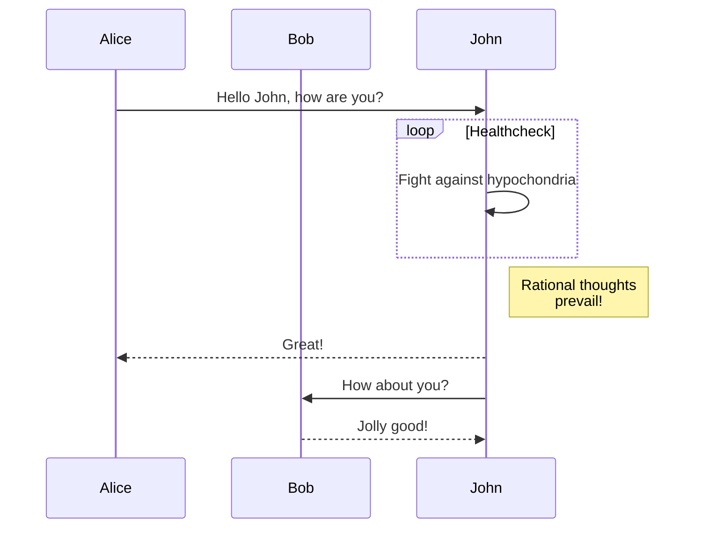

大约在十几年前，我也自己搭建过一个博客，在`Godaddy`买了虚拟主机和一个域名，搭建好`LAMP`环境，再装上`Wordpress`就开始折腾了。什么`百度统计`、`Google广告`、`Jiathis`等等全都安排上。那个时候在网上结识了一帮志同道合的网友，一起聊建站心得，甚至网站的`PR`值升到2时还兴奋的奔走相告。

后来由于种种原因博客就荒废了，再后来就没有了……

## 起因

直到今年国庆前后，我写了一个`PS2`相关的开源项目，想把整理的一些文档分享到网上，所以开始物色一个平台。我的要求很简单，只要能完美支持`markdown`就可以了。因为我写的文章都是`md`格式保存的。

一开始知乎是我的首选，还在上面创建了专栏。我被知乎文本编辑器里提示的“markdown语法识别中”迷惑了，本以为它可以支持`markdown`。但现实很打脸，这完全是个骗局，***知乎不支持markdown***。语雀、飞书、钉钉个人版虽然看着都不错，但其在线模式和私有格式，让我无法接受它们。

这促使我有了再次搭建个人博客的想法……

## 选型

相比于10年前，现在搭建博客的门槛低了不少，甚至不用买任何虚拟主机或云服务，完全免费。这中间，完美契合我的需求的是各种各样的`Pages`——`Github Pages`、`Cloudflare Pages`和`Gitee Pages`。平台提供免费的静态网站服务和免费的SSL证书，甚至SSL证书都是平台自动申请和续期。跟十年前相比，简直不要太方便。

我的使用场景是这样的：
- 先建立一个`git`仓库，这样我就有一个可以永久保存文件的地方，并且多端同步。
- 使用`markdown`格式写文章或者文档，按照自己喜欢的目录结构存放，提交到`git`仓库。
- 使用静态网站生成程序把`markdown`文件转换成`html`和`css`等静态资源。
- 发布到`Pages`服务。

我选择的是`Github Pages` + `Hugo`来生成我的博客。没有什么特殊原因，如果下次要选择我可能会选择其它的。

## 建站

### 使用`Hugo`生成网站

网上教程很多，这里不做赘述。`Hugo`不是唯一选项，选择你喜欢的静态网站生成程序即可。

`Hugo`生成的目录模版是这样的：

```
my-site/
├── archetypes/
│   └── default.md
├── assets/
├── content/
├── data/
├── i18n/
├── layouts/
├── static/
├── themes/
└── hugo.toml         <-- site configuration
```

创建的文章都在`content`目录下，编译时只要运行命令即可生成静态网站的所有资源。

### 使用`Github Pages`运行网站

首先你需要在`github`上创建一个`Github Pages`的仓库，具体操作不做赘述。将上一步生成的静态资源上传到这个仓库中，触发预先配置好的`workflow`即可自动部署网站。

> 如果你选择`Hugo`，下面这个地方的设置要注意
> 
> `Build and deployment`设置中`workflow`选择`Deploy static content to Pages`，由`Hugo`本地编译静态资源，可以大大提升`Github Pages`的部署速度。
> 
> 

下面说一下域名的两种玩法。

第一种玩法是博客使用`github`分配的域名，比如`xxx.github.io`，好处是真的是纯免费了，连域名都不花钱了。坏处是`github.io`在国内访问速度非常不稳定。这种玩法适合新手或者对博客要求不高的朋友。

第二种玩法是自己购买一个域名，将域名绑定在`Github Pages`上。这一步需要配置，参考官方文档。配置完后`Github`会自动帮你申请`SSL`证书，你的网站就可以使用`https`连接了。当然自有域名的好处还有很多，请看下一节。

### 使用`Cloudflare`优化网络

`github`在国内访问速度非常不稳定，体验不佳。如果你有自己的域名，可以注册一个`Cloudflare`账号，稍微配置一下就可以优化访问速度。

第一步，使用`Cloudflare`的`DNS`解析。如果你的域名不是在`Cloudflare`购买的，需要先将域名注册商那里的`DNS`解析服务器换成`Cloudflare`的，比如腾讯：


第二步，使用`dig`命令查看`Github Pages`分配给你的域名的真实ip地址：


第三步，在`Cloudflare`控制台创建你的域名指向上述ip地址的`DNS`解析`A记录`：


> 嫌第二步和第三步麻烦的话，可以直接使用一条`CNAME`记录指向你的`github.io`域名，效果是一样的。

其它的一些配置可以自己摸索一下，比如全站`SSL`和`JS`、`CSS`自动压缩等。设置好后，你可以使用一些测速网站来测试一下你的网站的访问速度，不出意外的话，应该比之前流畅多了。

我之前图片`CDN`服务使用的是`jsdelivr`，奈何服务不稳定，换了`Cloudflare`感觉还行，用起来还简单，何乐不为呢？

### 添加百度统计和Google Analytics

可以统计网站等访问量，`PV`、`UV`等数据，十几年前我的网站添加过，现在不知道有没有更好的。如果想添加的话，注册一个账号并且把一段`jacascript`代码贴在你的网页中就行。

### 向搜索引擎提交你的网站

新网站上线，如果想要各大搜索引擎快速收录的话，主动提交自己的网址也是一个不错的手段。下面是几大搜索引擎的收录提交网址：

- [Google](https://search.google.com/search-console)
- [Bing](https://www.bing.com/webmasters/)
- [百度](https://ziyuan.baidu.com/dailysubmit/)

> 如果没有域名备案，百度收录比较困难

## 个性化

### 主题

主题我选择了简约风格的`PaperMod`，照着说明配置即可。

### 代码高亮

如果你不喜欢`papermod`默认的代码高亮风格，你需要禁用`highlight.js`并启用`Chroma`。大家注意以下步骤以避免踩坑。

- 在`hugo.yml`里添加

```yaml
params:
  assets:
    disableHLJS: true
```

- 在`cunstom.css`里添加：

```css
:root {
    --hljs-bg: unset !important;
}
.dark {
    --hljs-bg: unset !important;
}
```

- 在`hugo.yml`里添加，并把`style`换成[Chroma Style Gallery](https://xyproto.github.io/splash/docs/all.html)里你喜欢的样式

```yaml
markup:
  highlight:
    codeFences: true
    guessSyntax: true
    lineNos: true
    # noClasses: false
    style: monokailight
```

你可以刷新下页面，看看效果，如果感觉不错，就不用再折腾了。如果你还有更高的追求，比如高亮模块可以根据黑暗模式自动切换，那就要使用自定义css。

- 修改`hugo.yml`

```yaml
markup:
  highlight:
    codeFences: true
    guessSyntax: true
    lineNos: true
    noClasses: false
```

- 生成`css`文件

```shell
hugo gen chromastyles --style=monokailight > syntax.css
```

好了，你有`css`了，尽情折腾吧，比如黑暗模式变换背景颜色：

```css
.highlight>.chroma {
    background: var(--bg-c)!important;
}

:root {
    --bg-c: #fafafa;
}
.dark {
    --bg-c: rgba(175, 184, 193, 0.2);
}
```

### 评论模块

静态网站添加评论模块有很多种方案，我选择的是[waline](https://waline.js.org/)，安装方法大家可以看它的官方文档。我把它部署在`Vercel`上，连接的数据库是`LeanCloud`，都是免费的。

`waline`支持黑暗模式的代码：

```css
/* # Waline 黑暗模式 */
body.dark {
    /* 下面是官网默认的黑暗模式配色 */
    /* 常规颜色 */
    --waline-white: #000;
    --waline-light-grey: #666;
    --waline-dark-grey: #999;

    /* 布局颜色 */
    --waline-color: #888;
    --waline-bgcolor: #1e1e1e;
    --waline-bgcolor-light: #272727;
    --waline-border-color: #333;
    --waline-disable-bgcolor: #444;
    --waline-disable-color: #272727;

    /* 特殊颜色 */
    --waline-bq-color: #272727;

    /* 其他颜色 */
    --waline-info-bgcolor: #272727;
    --waline-info-color: #666;
    --waline-border: 1px solid #888;
}
```

如果你不喜欢`waline`默认主题的绿油油的颜色，可以换成蓝色。

```css
body.dark {
    --waline-theme-color: #318dec !important;
    --waline-active-color: #318dec !important;
}
:root {
    --waline-theme-color: #60a7f1 !important;
    --waline-active-color: #60a7f1 !important;
}
```

### 支持mermaid语法

如果你想你的`markdown`能直接画图表，可以安装`mermaid`，安装方法在[官网](https://gohugo.io/content-management/diagrams/)。效果如下：



顺带一说，由于`jsdelivr`的不稳定，我选择了`cloudflare`的`cdn`：https://cdnjs.cloudflare.com/ajax/libs/mermaid/10.6.1/mermaid.esm.min.mjs

### 显示文章TOC

`TOC`就是侧边栏等文章大纲，如果不喜欢主题自带的`TOC`样式，可以自己定义。网上教程很多，不再赘述。比如下图：


## 最后

到此为止，基本能满足我的需求了。最后放一张平时写文章时的图：


我通常使用`VSCode`编写文章，实时预览`Markdown`格式非常方便。为了让图片在`VSCode`和网页上都能正常显示，我在项目的根目录下创建了一个名为`imgs`的软链接，指向`static/imgs`。这是因为`Hugo`在编译时会自动将`static`目录下的文件复制到网站的根目录下，所以使用绝对路径`/imgs/`可以在不同预览方式下找到文件。

我还创建了一个名为`public`的软链接，指向我的`Github Pages`仓库。当我完成文章的编写并使用`Hugo`进行编译时，它会自动将输出文件复制到`public`目录，即我的`Github Pages`仓库。最后，我使用`git`命令将更改推送到远程仓库，从而完成了网站的发布。

最后欢迎大家访问我新建的小站：[路边的阿不](https://babyno.top)。